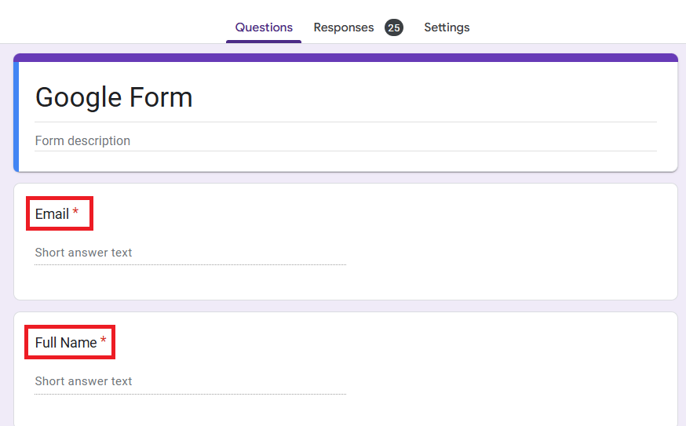

# Google Form Email Automation with Error Logging

This project automates email responses to Google Form submissions. Using Apps Script, it validates email addresses, sends personalized emails with an HTML template, and logs errors for debugging.

---

## Features

- **Personalized HTML Emails**: Sends customized emails using a predefined HTML template.
- **Email Validation**: Ensures that only valid email addresses receive responses.
- **Error Logging**: Logs errors to a dedicated sheet for easy debugging.
- **Trigger Setup**: Automatically links the script to form submissions.

---

## Step 1: Create the Google Form

### Design the Form
1. Open [Google Forms](https://forms.google.com) and create your form.
2. Add **two required fields** with the exact names:
   - **Full Name**
   - **Email**

  

3. Ensure that in **Form Settings**, the option to "Collect email addresses" is set to **Don’t collect** 
  > This setting avoids duplicating email fields and ensures compatibility with the script.
  
  .png "response settings")  
  .png "response settings")

---

## Step 2: Link the Form to a Google Sheet

1. In the Google Form, go to the **Responses** tab.
2. Click the green spreadsheet icon to create a linked Google Sheet where responses will be stored.

---

## Step 3: Add the Email Script to Google Sheets

### Open the Script Editor
1. In the linked Google Sheet, navigate to **Extensions > Apps Script**.

### Import the Script
1. Open the `sheet_appscript.js` file in this repository to view the script.
2. Copy the contents of the file.
3. Paste the script into the Apps Script editor in Google Sheets.

### Save and Authorize
1. Save the script (`Ctrl+S`) and name it (e.g., `Email Automation Script`).
2. Click **Review Permissions** when prompted and authorize the script.

### Set Up the Trigger
1. In the script editor, select the `setupTrigger` function.
2. Click the **Play (▶️)** icon to run the function. This sets up a trigger to automate email sending.

---

## Step 4: Test the Automation

1. Submit a test response using the Google Form.
2. Check the test email inbox for the personalized response.
3. If issues occur, refer to the **Error Log Sheet** in the Google Sheet for troubleshooting.

---

## Notes

- **Email Template**: Customize the email body in the `getEmailTemplate` function within `appscript.js`.
- **Email Validation**: The `isValidEmail` function checks for proper email formatting.
- **Error Logging**: Errors are logged to a sheet named "Error Log Sheet" for debugging.
- **Email Index**: Ensure `e.values[1]` corresponds to the email column in your sheet.
- **Gmail Limits**: Free Gmail accounts are limited to 100 emails per day.
