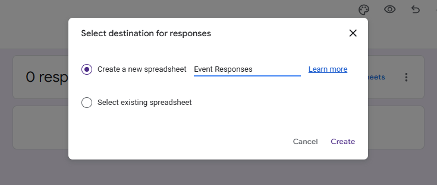

# Google Form Email Automation with Error Logging

This project automates email responses to Google Form submissions. Using Apps Script, it validates email addresses, sends personalized emails with an HTML template, and logs errors for debugging.

---

## Features

- **Personalized HTML Emails**: Sends customized emails using a predefined HTML template.
- **Email Validation**: Ensures that only valid email addresses receive responses.
- **Error Logging**: Logs errors to a dedicated sheet for easy debugging.
- **Trigger Setup**: Automatically links the script to form submissions.

---

## Step 1: Create the Google Form

### Design the Form
1. Open [Google Forms](https://forms.google.com) and select **Blank Form** to create a new form.  

2. Design the form as per your requirements. Ensure that you add the **two required fields** with the exact names as below and mark them as **Required**:
   - **Full Name**
   - **Email**  
  

3. Ensure that in **Form Settings**, the option to "Collect email addresses" is set to **Don’t collect**  
  > This setting avoids duplicating email fields and ensures compatibility with the script.  

  _In Settings tab:_ &nbsp;**Settings > Responses > Collect email addresses**  
  .png "response settings")  

  _In Settings tab:_ &nbsp;**Defaults > Form defaults > Collect email addresses by default**  
  .png "default settings")

---

## Step 2: Link the Form to a Google Sheet

1. In the Google Form, go to the **Responses** tab.
2. Click the green spreadsheet icon to create a linked Google Sheet where responses will be stored.  

3. Choose to create a new spreadsheet and provide a name for it, then click **Create**. (You can also select an existing spreadsheet if preferred.)  

---

## Step 3: Add the Email Script to Google Sheets

### Open the Script Editor
1. Open the linked Google Sheet and navigate to **Extensions > Apps Script**.  

### Import the Script
1. Open the `sheet_appscript.js` file in this repository to view the script. ( [Direct Link to script](./sheet_appscript.js) )
2. Copy the contents of the file.
3. Clear any existing code in the Apps Script editor and paste the copied script into the editor.  

---

## Step 4: Configure the Script

### Change the Email Subject and HTML Body content
1. Edit the `SUBJECT` constant in the script to your desired email subject.
2. Modify the `getEmailTemplate()` function to customize the email body content as needed.  

### Rename and Save
1. Click on the project name (default is "Untitled project") in the top left corner and rename it (e.g., `Email Automation Script`).  

2. Save the script (`Ctrl+S`).

---

## Step 5: Setup Trigger and Authorize the Script

### Set Up the Trigger
1. In the Apps Script editor toolbar, click on the dropdown `getEmailTemplate` and select `setupTrigger`.
2. Click the **Run (▶️)** icon to run the function. This sets up a trigger to automate email sending.  

### Authorize the Script
1. A dialog will appear requesting authorization. Click **Review Permissions**.  
  
2. Choose your Google account.
3. If you see a warning about the app being unverified, click on **Advanced** and then **Go to {Project Name} (unsafe)**.  

4. Choose **Select all** permissions and click **Continue**.  

---

## Step 6: Copy the Shortened URL of the Form
1. Go back to the Google Form.
2. Click the **Publish** button at the top right.  

3. Set the Responders to **Anyone with the link** option and click **Publish**.  

4. Check the **Shorten URL** checkbox and **Copy** the link provided.  

5. Share this link with your audience to start collecting responses.

---

## Step 7: Test the Automation

1. Submit a test response using the Google Form.
2. Check the test email inbox for the personalized response.
3. If issues occur, refer to the **Error Log** at the bottom of the Google Sheet for error logs for troubleshooting.  

---

## Notes

- **Email Template**: Customize the email subject by modifying the `SUBJECT` constant and body in the `getEmailTemplate()` function within `appscript.js`.
- **Email Validation**: The `isValidEmail()` function checks for proper email formatting.
- **Error Logging**: Errors are logged to a sheet named **"Error Log"** for debugging.
- **Email Index**: Ensure `e.values[1]` corresponds to the email column in your sheet.
- **Gmail Limits**: Free Gmail accounts are limited to **100 emails per day**.
